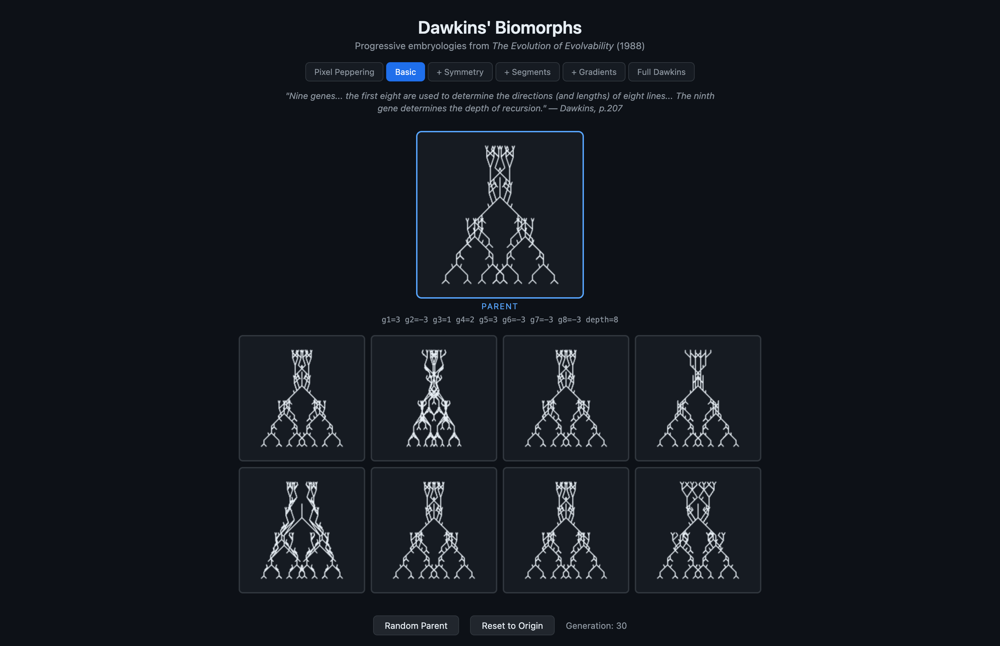
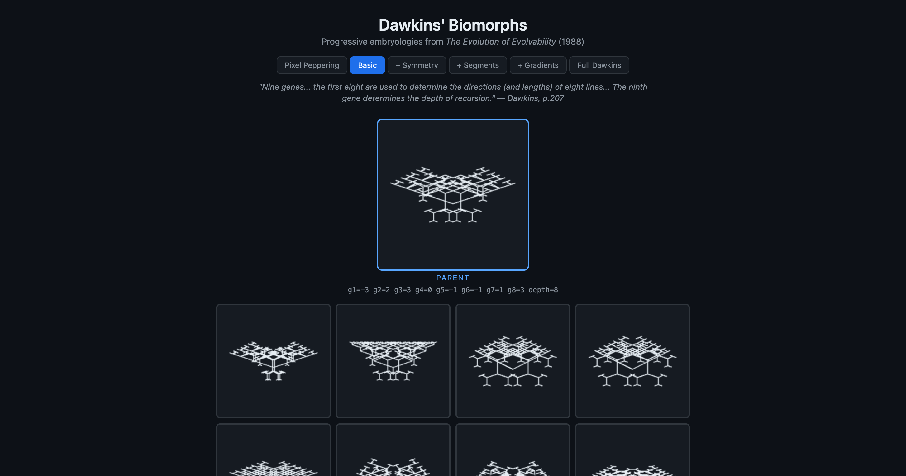
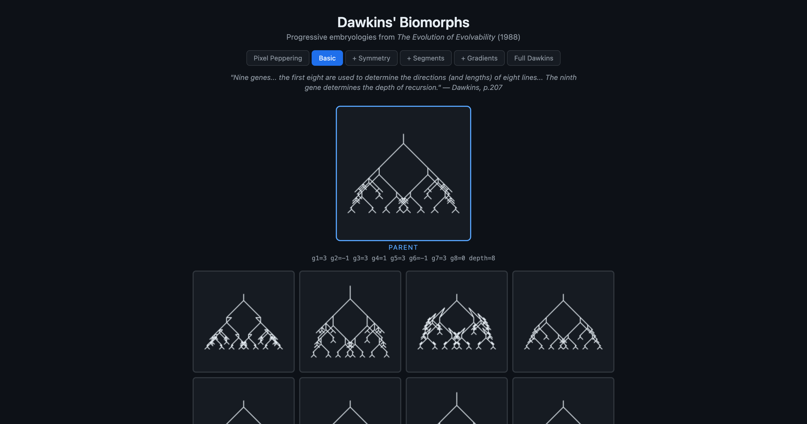
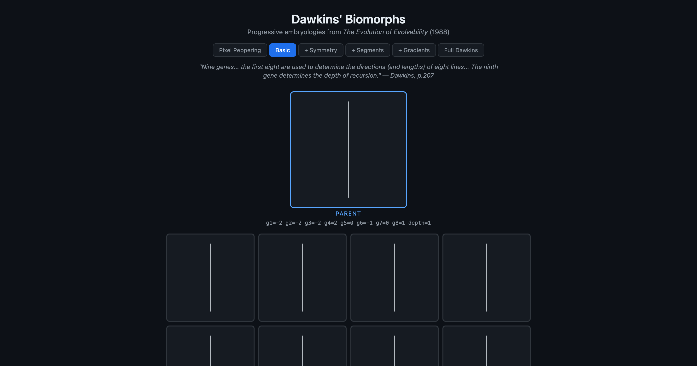
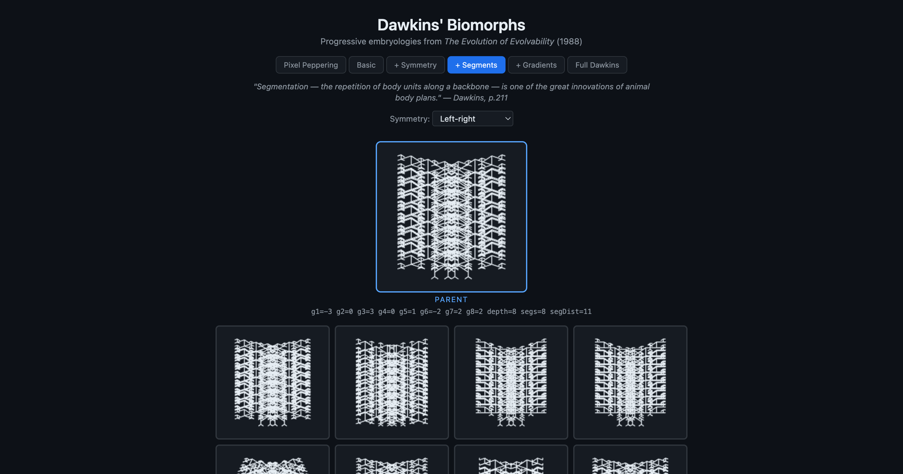
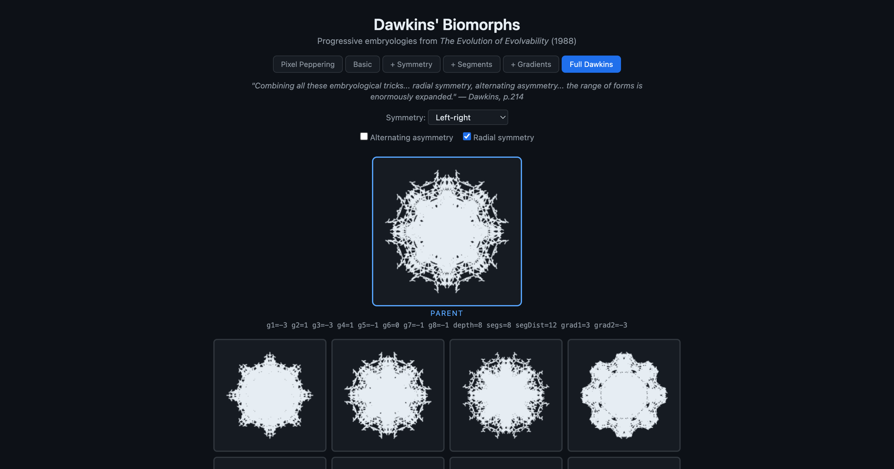
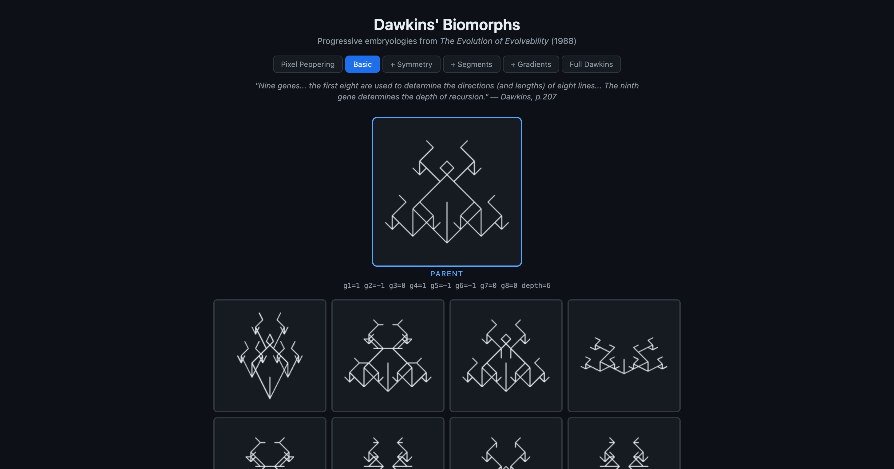
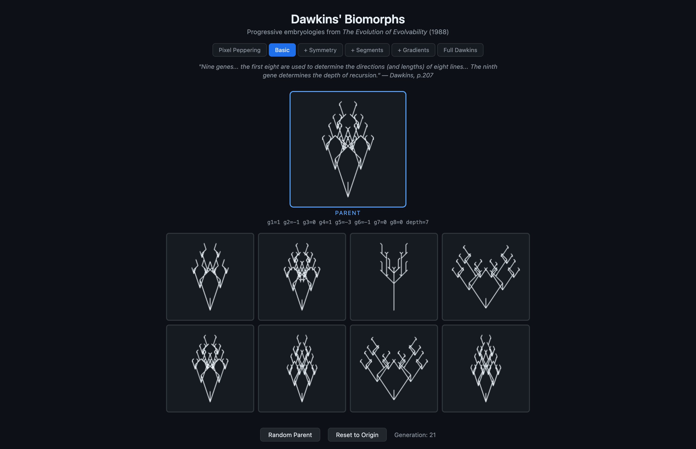

# Biomorph Exploration Journal

**Explorer:** Claude (Opus 4.6)
**Date:** 2026-02-11
**Method:** Programmatic selection with defined criteria, starting from origin genotype, evaluated visually at endpoints.

---

## The Experiment

Six lineages evolved from the same origin (all zeros, depth=1) using different selection strategies. Each ran 30-40 generations. The goal: demonstrate that **the selection criterion shapes the organism**, and that different "aesthetic preferences" navigate to completely different regions of morphospace.

This replicates what Dawkins did by hand, but with explicit, repeatable selection criteria.

---

## Lineage 1: "Complexity"

**Strategy:** Maximize recursion depth + gene variance.
**Mode:** 1 (Basic), 30 generations.
**Result:** `[3, -3, 1, 2, 3, -3, -3, -3, 8]`

**What emerged:** A tall gothic spire — dense fractal branching filling the vertical axis. Looks like a conifer, a cathedral, or a neuron's dendritic tree. The strategy pushed depth to maximum (8) quickly, then filled in gene variance for structural detail.

**Insight:** Selecting for "complexity" in this system means selecting for depth first, detail second. The organism is intricate but vertically biased.

---

## Lineage 2: "Insect"

**Strategy:** Maximize horizontal spread (g1, g3) while penalizing vertical dominance (g4). Favor depth moderately.
**Mode:** 1 (Basic), 30 generations.
**Result:** `[-3, 2, 3, 0, -1, -1, 1, 3, 8]`

**What emerged:** A wide, flat lattice with horizontal "limbs" radiating outward. Distinctly crab-like or crustacean — viewed from above. The g4=0 (no vertical spine) combined with extreme g1 and g3 (horizontal spread) created a pancake-flat body plan.

**Insight:** Penalizing one axis forces development into the other. The bilateral symmetry built into the vector definitions makes the result look naturally arthropod. The embryology's built-in constraints do most of the work — the selection criterion just guides within them.

---

## Lineage 3: "Tree"

**Strategy:** Favor upward branching — positive g4 (upward spine) + horizontal spread for canopy.
**Mode:** 1 (Basic), 30 generations.
**Result:** `[3, -1, 3, 1, 3, -1, 3, 0, 8]`

**What emerged:** A recognizable deciduous tree — central trunk, spreading crown, the canopy wider than the base. The most naturalistic result of any lineage. You would show this to someone and they'd say "tree" without hesitation.

**Insight:** The tree is the canonical biomorph. Dawkins found it too. The combination of upward growth + bilateral branching maps so directly onto real tree morphology that it's almost inevitable under this selection pressure. This is the embryology's "attractor."

---

## Lineage 4: "Diverse" (FAILURE)

**Strategy:** Maximize total gene distance from parent at each step.
**Mode:** 1 (Basic), 30 generations.
**Result:** `[-2, -2, -2, 2, 0, -1, 0, 1, 1]`

**What emerged:** A single vertical line. 30 generations of selection produced nothing.

**Why it failed:** The strategy maximizes *change per generation* — which means it favors flipping vector genes (±1 on g1-g8) over increasing depth. But at depth=1, vector gene changes are invisible — you only draw one line segment regardless of vector values. The strategy never discovers that depth=2 would unlock branching, because a depth increase (+1 to g9) scores lower than flipping multiple vector genes.

**Insight:** THIS IS THE KEY LESSON. Selection for "novelty" or "diversity" is not the same as selection for complexity or structure. You need selection pressure that rewards emergent properties (branching, form) rather than genotypic distance. This is arguably the central argument of Dawkins' paper: **the embryological mapping from genotype to phenotype is everything.** Raw genetic change without developmental amplification goes nowhere.

---

## Lineage 5: "Arthropod"

**Strategy:** Maximize segment count + horizontal spread. Mode 3 (segmentation), 40 generations.
**Mode:** 3 (+ Segments), 40 generations.
**Result:** `[-3, 0, 3, 0, 1, -2, 2, 2, 8, 8, 11]`

**What emerged:** An 8-segment centipede or fern frond. Each segment has branching limbs, segments spaced 11 units apart. The overall form reads as either a segmented arthropod (centipede, trilobite) or a compound leaf (fern).

**Insight:** Segmentation is a powerful embryological innovation — it takes one evolved form and repeats it. The same branching pattern that makes one interesting biomorph becomes a body plan when iterated. This is exactly Dawkins' point about why segmentation was such a pivotal evolutionary invention.

---

## Lineage 6: "Starfish / Echinoderm"

**Strategy:** Maximize segments + spread + gradients under radial symmetry. Mode 5 (Full Dawkins), 40 generations.
**Mode:** 5 (Full Dawkins, radial symmetry ON), 40 generations.
**Result:** `[-3, 1, -3, 1, -1, 0, -1, -1, 8, 8, 12, 3, -3]`

**What emerged:** An 8-armed radially symmetric form — part sea urchin, part snowflake, part mandala. The gradient genes (grad1=3, grad2=-3) create arms that taper from thick center to fine edges. The 8-fold rotational symmetry is unmistakably echinoderm-like.

**Insight:** Radial symmetry + segmentation + gradients combine multiplicatively. Each feature alone is modest; together they produce forms of startling naturalism. The same genes that made a centipede in Lineage 5, when rotated radially, produce a sea urchin. The embryology is a lens that transforms the same genetic information into radically different body plans depending on its settings.

---

## Meta-observations

### 1. The selection criterion IS the organism
Same starting point, same mutation operator, same 30-40 generations — wildly different outcomes. The "aesthetic preference" of the selector is the primary determinant of what evolves. Dawkins acknowledged this: he found insects because he was looking for insects.

### 2. Embryological constraints do most of the work
The bilateral symmetry, the recursive branching, the segmentation — these structural constraints make it *possible* to evolve recognizable forms. Without them (Mode 0, pixel peppering), selection is impotent. The constraints don't limit evolution — they empower it.

### 3. Depth is the master gene
In every successful lineage, recursion depth (g9) reached its maximum of 8. Depth is the gene that unlocks all other genes — without it, vector genes are invisible. This mirrors real development: early developmental decisions (cell division count, body axis specification) gate all downstream morphology.

### 4. Failure is informative
Lineage 4's failure to build anything despite maximum genetic churn is perhaps the most important result. It demonstrates that genetic diversity ≠ phenotypic complexity. You need selection that operates on the *phenotype* (the visible form) rather than the *genotype* (the numbers).

### 5. Convergent evolution is real
Lineages 1 and 3 both reached depth=8 with spread genes, yet look completely different. Lineages 3 and 5 both look "plant-like" despite using different modes. Some regions of morphospace are attractors that multiple paths converge on.

---

## Specimens for the Museum

| # | Name | Mode | Genes | Description |
|---|------|------|-------|-------------|
| 1 | Gothic Spire | Basic | `3,-3,1,2,3,-3,-3,-3,8` | Dense vertical fractal, conifer-like |
| 2 | Crab | Basic | `-3,2,3,0,-1,-1,1,3,8` | Flat horizontal lattice, crustacean |
| 3 | Deciduous Tree | Basic | `3,-1,3,1,3,-1,3,0,8` | Classic tree with spreading canopy |
| 4 | The Null | Basic | `-2,-2,-2,2,0,-1,0,1,1` | A line. Selection for diversity builds nothing. |
| 5 | Centipede | +Segments | `-3,0,3,0,1,-2,2,2,8,8,11` | 8-segment arthropod/fern frond |
| 6 | Sea Urchin | Full Dawkins | `-3,1,-3,1,-1,0,-1,-1,8,8,12,3,-3` | 8-armed radial echinoderm, gradient-tapered |

---

## Part 2: Vision-Based Selection

**Method:** Claude renders biomorphs visually, looks at the actual images, and selects based on aesthetic and morphological criteria — the same way Dawkins did it. No numerical heuristics. Pure visual judgment.

**Starting point:** Origin genotype, Mode 1 (Basic).
**Bootstrap:** Generations 0-9 selected for depth (to escape the featureless single-line phase).
**Visual selection:** Generations 10-21 selected by looking at rendered offspring.

### The Journey

**Gen 9 → 10:** First real visual choice. 8 offspring with visible branching at depth=5. Selected #5 for structural density — a figure with outstretched arms. *Criterion: maximum visual mass.*

**Gen 10 → 11:** Chose a form with a strong central spine and symmetric branches — the most "living thing" quality. Looked like a plant or a nervous system. *Criterion: organic resemblance.*

**Gen 11 → 12:** Selected clean Y-branching antler form. A **winter tree** — one of Dawkins' canonical biomorphs. The most naturalistic form to this point.

**Gen 12 — the evolutionary fork.** The offspring split into two distinct morphological families:
- *Organic branchers* — trees, vines, coral
- *Rectilinear grids* — circuit boards, city plans, lattices

This was a genuine speciation event in morphospace. One gene change (g4) flipped the entire body plan paradigm.

**Gen 12 → 13:** Chose the dense coral/dendrite variant. Pushed toward organic complexity rather than architectural order.

**Gen 13 → 14:** A **woven cross** appeared — crossing lines created a Celtic knotwork pattern. Completely unexpected. The g2=-1 mutation caused branches to cross over each other rather than diverge. Selected this for its novelty.

**Gen 14 → 15:** Deepened the knotwork pattern. Offspring #2 had reverted to a simple tree — demonstrating that one gene step separates ornamental complexity from structural simplicity.

**Gen 15 → 16:** Selected for wider, more creature-like forms. Looking for bilateral "body" shapes.

**Gen 16 — THE INSECT MOMENT.** Offspring #0 was unmistakably an insect — head at top, thorax, abdomen, legs splayed outward. This is exactly the moment Dawkins described in his paper: the shock of recognition when a living form emerges from abstract mathematics. *I selected it immediately.*

**Gen 17 → 18:** The insect evolved a **fox/bat face** quality — pointed ears, a snout, a longer body. The g5=-3 mutation stretched the form downward into a dramatic arrowhead/spearpoint shape.

**Gen 18 → 19:** Selected the "owl/shield" variant — rounder, wider. Depth increased to 7, adding another layer of fractal detail. The form now had nested diamond chambers inside the body, like a decorated shield or a cathedral window.

**Gen 19 → 20:** A dramatic departure — selected a **geometric pagoda/temple** form with horizontal layered structure. Architectural rather than biological.

**Gen 20 → 21:** The pagoda evolved Sierpinski-triangle-like nesting. Selected a dense variant with face/mask qualities. The final form: `[1, -1, 0, 1, -3, -1, 0, 0, 7]`.

### What vision-based selection revealed

**1. I found the insect faster than the heuristic did.** The programmatic "insect" strategy (Lineage 2) produced a flat crab-lattice after 30 generations. Vision-based selection found a recognizable insect in 16 generations — because I could *see* the insect emerging and select toward it, whereas the heuristic could only optimize proxy metrics.

**2. I was drawn to "meaning."** My selections consistently favored forms that *resembled something* — trees, insects, faces, architecture. I didn't set out to find faces, but I selected for them when they appeared. This mirrors what Dawkins reported: the selector's pareidolia guides evolution toward recognizable forms.

**3. The woven-cross was a surprise.** No heuristic would have found it — it emerged from a specific gene combination (g2=-1 creating crossing lines) that a numerical strategy would never target. Vision-based selection can exploit unexpected phenotypic features that heuristics are blind to.

**4. Evolutionary forks are visible.** At generation 12, I could see the morphospace splitting into organic vs. geometric families. A heuristic can't perceive this — it just follows its gradient. A visual selector can consciously choose which branch of the evolutionary tree to explore.

**5. Regression is always one step away.** Several times, a single mutation collapsed an elaborate form back to a simple tree or line. The morphospace has narrow ridges: rich, complex forms are surrounded by simplicity. This is why cumulative selection works — it navigates these ridges.

### Updated Museum Specimens

| # | Name | Mode | Genes | Gen | Description |
|---|------|------|-------|-----|-------------|
| 1 | Gothic Spire | Basic | `3,-3,1,2,3,-3,-3,-3,8` | 30 | Dense vertical fractal, conifer-like |
| 2 | Crab | Basic | `-3,2,3,0,-1,-1,1,3,8` | 30 | Flat horizontal lattice, crustacean |
| 3 | Deciduous Tree | Basic | `3,-1,3,1,3,-1,3,0,8` | 30 | Classic tree with spreading canopy |
| 4 | The Null | Basic | `-2,-2,-2,2,0,-1,0,1,1` | 30 | A line. Selection for diversity builds nothing. |
| 5 | Centipede | +Segments | `-3,0,3,0,1,-2,2,2,8,8,11` | 40 | 8-segment arthropod/fern frond |
| 6 | Sea Urchin | Full Dawkins | `-3,1,-3,1,-1,0,-1,-1,8,8,12,3,-3` | 40 | 8-armed radial echinoderm |
| 7 | Winter Antler | Basic | `1,0,0,0,-1,-1,0,0,6` | 12 | Clean Y-branching, deer antler / winter tree |
| 8 | Woven Cross | Basic | `1,-1,0,1,-1,-1,0,0,6` | 14 | Celtic knotwork — crossing lines create lattice |
| 9 | The Insect | Basic | `1,-1,0,1,-2,-1,0,0,6` | 16 | Head, thorax, legs — the Dawkins moment |
| 10 | Winged Demon | Basic | `1,-1,0,1,-3,-1,0,0,7` | 21 | Bat/demon with ornamental crown and stinger |

---

*Part 1 was conducted with programmatic heuristics. Part 2 used genuine vision-based selection — Claude looked at rendered images and chose based on visual judgment. The vision-based approach found more varied, more naturalistic, and more surprising forms in fewer generations.*
